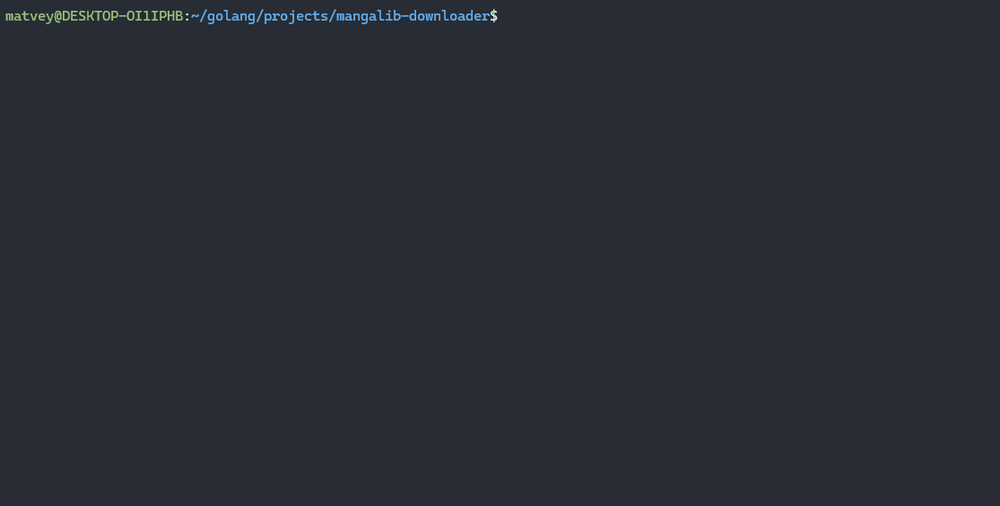

<div align="center">
	<h1>mangalib-downloader</h1>
	<h3>Консольное приложение для скачивания манги с сайта MangaLib</h3>
	</img>
</div>

## Возможности
- Скачивать выбранные главы
- Поиск по названию
- Изменение пути к папке сохранения

## Установка
**Проверка работоспособности программы на устройствах компании Apple и дистрибутивах, отличных от Ubuntu, не проводилась.**

### Windows/Ubuntu
Для установки последней версии программы посетите [страницу релизов](https://github.com/matvikFX/mangalib-downloader/releases).

### Сборка исходников
Разработка программы проводилась на Go v1.22.0. Компиляция программы на прошлых версиях языка не проводилась.\
Команду go mod tidy не обязательно прописывать, так как при компиляции, библиотеки автоматически подтянуться. Но это не точно
```sh
git clone https://github.com/matvikFX/mangalib-downloader.git
cd mangalib-downloader
go build
```

## Использование
### Горячие клавиши
<table>
  <thead>
    <tr>
      <th>Операции</th>
      <th>Горячие клавиши</th>
    </tr>
  </thead>
  <tbody>
    <tr>
      <td align="center" colspan="2"><strong>Универсальные</strong></td>
    </tr>
    <tr>
      <td>Закрыть окно/страницу</td>
      <td>Esc</td>
    </tr>
    <tr>
      <td>Закрыть программу</td>
      <td>Ctrl + C</td>
    </tr>
    <tr>
      <td>Окно поиска</td>
      <td>Ctrl + S</td>
    </tr>
    <tr>
      <td>Помощь</td>
      <td>Shift + H</td>
    </tr>
    <tr>
      <td>Окно настроек</td>
      <td>Shift + P</td>
    </tr>
    <tr>
      <td align="center" colspan="2"><strong>Список манги</strong></td>
    </tr>
    <tr>
      <td>Обнуление поиска/страницы</td>
      <td>Escape</td>
    </tr>
    <tr>
      <td>След/Пред страница</td>
      <td>Ctrl + F/B</td>
    </tr>
    <tr>
      <td align="center" colspan="2"><strong>Страница манги</strong></td>
    </tr>
    <tr>
      <td>Выбрать главу</td>
      <td>Enter/Space</td>
    </tr>
    <tr>
      <td>Выбрать ветру перевода</td>
      <td>Ctrl + T</td>
    </tr>
    <tr>
      <td>Скачать выбранные главы</td>
      <td>Alt + D</td>
    </tr>
    <tr style="color:red">
      <td>Скачать всю мангу</td>
      <td>Alt + A</td>
    </tr>
  </tbody>
</table>

## Дальнейшее развитие
### Основное
- Исправить скачивание любой манги целиком, чтобы не возникало никаких ошибок (основная - слишком много запросов).
- Добавить индикатор загрузки
- Добавить цвета интерфейсу.
- Добавить другие сайты LibSocial'a
- Добавить возможность входа в аккаунт LibSocial
	- Предоставить возможность просматривать сохраненные тайтлы, а также состояния прочтения.

### Маловероятно
- Управление мышкой. Из-за чего-то использование мыши приводит к высокой нагрузке на систему.
