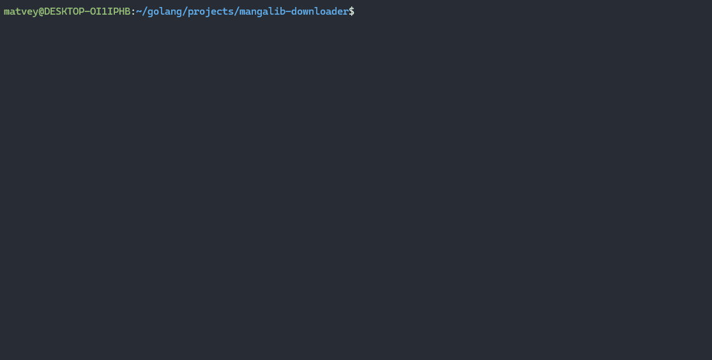

<div align="center">
  <h1>mangalib-downloader</h1>
  <h3>Консольное приложение для скачивания манги с сайта MangaLib</h3>
  </img>
</div>

## Возможности
- Скачивание выбранных глав
- Скачивание всех глав манги
- Поиск по названию
- Изменяемый путь к папке скачанной манги
- Скачивание манги с возрастным ограничением 18+ (читайте раздел "Использование/Возрастное ограничение")

## Установка
**Проверка работоспособности программы на устройствах компании Apple и дистрибутивах, отличных от Ubuntu, не проводилась.**

### Windows/Ubuntu
Достаточно скачать программу со [страницы релизов](https://github.com/matvikFX/mangalib-downloader/releases), чтобы начать ей полноценно пользоваться.

### Сборка исходников
Разработка программы велась на Go v1.22.0. Сборка программы на прошлых версиях языка не проводилась.
```cmd
git clone https://github.com/matvikFX/mangalib-downloader.git
cd mangalib-downloader
go build
```

## Использование
Приложение создает файл "config" в папке с вызываемым файлом приложения. Файл должен весить ~150 байт.\
Файл "config" хранит в себе следующие пути:
- путь папки загрузки манги
- путь папки логов ошибок приложения
- путь файла с закладками

Перемещение осуществляется за счет стрелочек или jk.\
За выбор манги или главы отвечают клавиши Space и Enter.

### Горячие клавиши
<table>
  <thead>
    <tr>
      <th>Операции</th>
      <th>Горячие клавиши</th>
    </tr>
  </thead>
  <tbody>
    <tr>
      <td align="center" colspan="2"><strong>Универсальные</strong></td>
    </tr>
    <tr>
      <td>Закрыть окно/страницу</td>
      <td>Esc</td>
    </tr>
    <tr>
      <td>Закрыть программу</td>
      <td>Ctrl + C</td>
    </tr>
    <tr>
      <td>Окно поиска</td>
      <td>Ctrl + S</td>
    </tr>
    <tr>
      <td>Помощь</td>
      <td>Shift + H</td>
    </tr>
    <tr>
      <td>Окно настроек</td>
      <td>Shift + P</td>
    </tr>
    <tr>
      <td align="center" colspan="2"><strong>Список манги</strong></td>
    </tr>
    <tr>
      <td>Обнуление поиска/страницы</td>
      <td>Escape</td>
    </tr>
    <tr>
      <td>След/Пред страница</td>
      <td>Ctrl + F/B</td>
    </tr>
    <tr>
      <td align="center" colspan="2"><strong>Страница манги</strong></td>
    </tr>
    <tr>
      <td>Выбрать главу</td>
      <td>Enter/Space</td>
    </tr>
    <tr>
      <td>Выбрать ветру перевода</td>
      <td>Ctrl + T</td>
    </tr>
    <tr>
      <td>Скачать выбранные главы</td>
      <td>Ctrl + D</td>
    </tr>
    <tr style="color:red">
      <td>Скачать всю мангу</td>
      <td>Ctrl + A</td>
    </tr>
  </tbody>
</table>

### Возрастное ограничение
Для скачивание манги c возрастным ограничением, требуется иметь аккаунт mangalib!!!
Чтобы скачивать мангу требуется залогниться на сайте [MangaLib](mangalib.me).
Нажатием F12 открываем консоль разработчика и заходим в раздел Хранилище/Storage(браузеры, основанные на Firefox) или Приложение/Application (браузеры, основанные на Chrome). В нем выбираем "Local Storage" или "Локальное хранилище" и https://mangalib.me, соответственно. Выбираем ключ auth, открываем поле "token" и копируем access_token.
Создаем файл auth_token в корневой папке программы вставляем токен и удаляем все лишнее. Перед самим токеном добавляем метод "Bearer", либо же другой, если в поле "token_type" был указан другой тип токена.
Пример конечного файла: Bearer eyJ0eXAiOi...
Чуть позже будет добавлено видео и улучшено описание.

## Проблемы
### Более часто встречаемые
- Некорректное открытие страницы манги.
  - Просто открывайте желаемую вами мангу, не надо сначала сидеть что-то ожидать на одной, потом резко перескакивать и откывать другую.

### Редкие
- При скачивании полной манги, может возникнуть ошибка 429(TooManyRequests), которая приведет к неправильному завершению работы программы.
- По какой-то причине все страницы у некоторых глав могут неправильно скачаться.
  - Тип файла будет правильным, но содержать файл будет HTML страницу примерно со следющим содержанием:
    ```html
    <span id="challenge-error-text">Enable JavaScript and cookies to continue</span>
    ```

## Дальнейшее развитие
### Основное
- Исправить существующие проблемы
- Добавить:
  - Индикатор загрузки
  - Цвета интерфейсу.

### Маловероятно
- Управление мышкой. Из-за чего-то использование мыши приводит к высокой нагрузке на систему.
- Другие сайты LibSocial'a
- Возможность входа в аккаунт LibSocial
